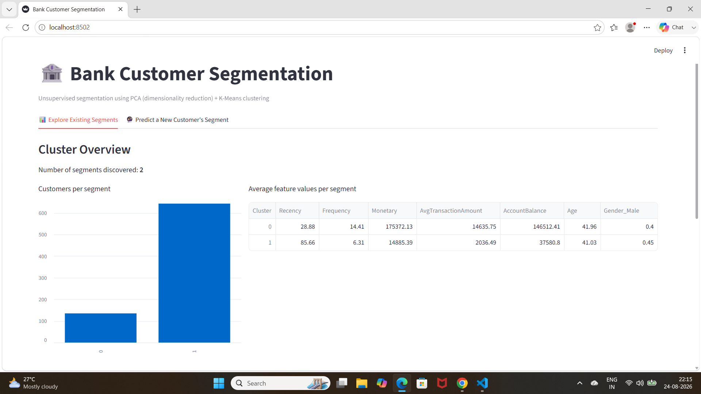

# 🏦 Bank Customer Segmentation System (PCA + K-Means)


> An end-to-end unsupervised Machine Learning pipeline delivering customer segmentation via Principal Component Analysis (PCA) and K-Means clustering, integrated with an interactive Streamlit inference UI.

---

### 🖥️ Live Application Preview
<div align="center">
  
</div>

---

# Bank Customer Segmentation using PCA + K-Means

An unsupervised machine learning project that segments bank customers into
distinct behavioural groups using **Principal Component Analysis (PCA)** for
dimensionality reduction and **K-Means clustering** for grouping — enabling
targeted marketing, retention strategy, and personalized banking services.

---

## 1. Problem Statement

Banks accumulate large volumes of customer transaction data but often treat
their entire customer base with a one-size-fits-all strategy for marketing,
product recommendations, and retention efforts. This is inefficient: a
high-balance, frequently-transacting customer has very different needs from a
dormant, low-activity customer, yet both may receive identical communication
and offers.

**Who faces the problem:** Retail banks and their marketing/CRM teams, who
lack a data-driven way to group customers by actual behaviour rather than
static demographics alone.

**Why existing approaches fall short:** Manual or rule-based segmentation
(e.g., simple balance thresholds) fails to capture the multi-dimensional
nature of customer behaviour — recency of activity, transaction frequency,
spending patterns, and account balance interact in ways that simple rules
cannot represent.

**How AI/ML addresses it:** By combining engineered behavioural features
(Recency, Frequency, Monetary — RFM) with demographic data, applying PCA to
reduce noise/redundancy, and using K-Means to discover natural groupings, the
system uncovers data-driven customer segments without requiring pre-labeled
categories.

**What the system does:** Ingests raw transaction data, cleans it, engineers
customer-level behavioural features, reduces dimensionality with PCA, and
clusters customers into segments — visualized and explorable through a
Streamlit web app, which can also classify a new customer into a segment.

**Expected output:** Each customer is assigned a cluster label (e.g., a
"high-value" or "dormant" style segment), along with a profile summary of
what characterizes that segment.

---

## 2. Objectives

1. Clean and preprocess raw, messy bank transaction data.
2. Engineer meaningful customer-level behavioural features (RFM + demographics).
3. Reduce dimensionality using PCA while retaining most of the variance.
4. Cluster customers using K-Means, selecting the optimal number of clusters via the Elbow Method and Silhouette Score.
5. Deliver an interactive Streamlit app to explore segments and classify new customers.

---

## 3. AI/ML Component

| Aspect | Details |
|---|---|
| ML Problem Type | Unsupervised Learning — Clustering |
| Dimensionality Reduction | PCA (Principal Component Analysis) |
| Clustering Algorithm | K-Means |
| Input Data | Bank transaction records (customer ID, DOB, gender, location, balance, transaction date/time/amount) |
| Engineered Features | Recency, Frequency, Monetary, Average Transaction Amount, Account Balance, Age, Gender |
| Output | Cluster label per customer + cluster profile (segment characteristics) |
| Evaluation Metrics | Silhouette Score, Davies–Bouldin Index, Elbow Method (inertia) |

---

## 4. Dataset

This project is structurally modeled on the popular Kaggle dataset
**["Bank Customer Segmentation"](https://www.kaggle.com/datasets/shivamb/bank-customer-segmentation)**
(transaction-level data: `TransactionID`, `CustomerID`, `CustomerDOB`,
`CustGender`, `CustLocation`, `CustAccountBalance`, `TransactionDate`,
`TransactionTime`, `TransactionAmount (INR)`).

> **Note:** `data/raw/bank_transactions_raw.csv` in this repo is a
> **synthetically generated, deliberately UNCLEANED** dataset that mirrors the
> real Kaggle dataset's schema and messiness (missing values, inconsistent
> gender labels, mixed date formats, currency strings, duplicates, and
> outliers) — generated by `scripts_generate_raw_data.py`. This lets the full
> cleaning pipeline be demonstrated and graded, without requiring Kaggle
> authentication to download the original file. If you have a Kaggle
> account, you can swap in the real dataset from the link above — the
> cleaning/notebook pipeline expects the same column names, so it will work
> unchanged.
>
> To use the real dataset instead: download it from Kaggle (requires a free
> Kaggle account + API token), place it at
> `data/raw/bank_transactions_raw.csv`, and re-run the notebooks in order.

- **Rows:** ~6,000+ raw transactions across 800 synthetic customers
- **Target variable:** None (unsupervised) — the model discovers `Cluster` itself
- **Preprocessing required:** Yes — extensively (see Notebook 01)

---

## 5. Technology Stack

- Python 3
- Pandas, NumPy — data manipulation
- Scikit-learn — StandardScaler, PCA, KMeans, evaluation metrics
- Matplotlib, Seaborn — visualization
- Streamlit — interactive web app
- Joblib — model persistence
- Jupyter Notebook — analysis & documentation

---

## 6. Project Workflow

```
Raw Transactions (messy CSV)
        │
        ▼
 01_data_cleaning.ipynb      → cleaned transaction-level data
        │
        ▼
 02_eda_feature_engineering.ipynb → customer-level RFM + demographic features
        │
        ▼
 03_pca_kmeans_clustering.ipynb   → StandardScaler → PCA → K-Means → Cluster labels
        │
        ▼
   Streamlit App (app/app.py)  → explore segments / predict new customer's segment
```

---

## 7. Repository Structure

```
bank-customer-segmentation/
│
├── README.md                          # Project documentation (this file)
├── requirements.txt                   # Python dependencies
├── .gitignore
├── scripts_generate_raw_data.py       # Generates the synthetic uncleaned raw dataset
│
├── data/
│   ├── raw/
│   │   └── bank_transactions_raw.csv          # UNCLEANED raw data (input)
│   └── processed/
│       ├── bank_transactions_clean.csv        # Output of Notebook 01
│       ├── customer_features.csv              # Output of Notebook 02
│       └── customer_segments.csv              # Output of Notebook 03 (final labeled data)
│
├── notebooks/
│   ├── 01_data_cleaning.ipynb                 # Missing values, formats, duplicates, outliers
│   ├── 02_eda_feature_engineering.ipynb       # EDA + RFM feature engineering
│   └── 03_pca_kmeans_clustering.ipynb         # PCA + K-Means + evaluation + profiling
│
├── src/
│   ├── data_cleaning.py                       # Reusable cleaning functions (mirrors NB 01)
│   └── clustering.py                          # Reusable feature-engineering & clustering functions
│
├── app/
│   ├── app.py                                 # Streamlit web app
│   ├── scaler.joblib                          # Trained StandardScaler (generated by NB 03)
│   ├── pca.joblib                             # Trained PCA transformer (generated by NB 03)
│   ├── kmeans_model.joblib                    # Trained KMeans model (generated by NB 03)
│   └── feature_cols.joblib                    # Feature column order (generated by NB 03)
│
└── reports/
    └── figures/                               # Saved charts (EDA + clustering visuals)
```

---

## 8. How to Run

```bash
# 1. Clone the repo and install dependencies
pip install -r requirements.txt

# 2. (Optional) Regenerate the raw uncleaned dataset
python scripts_generate_raw_data.py

# 3. Run the notebooks in order (or open in Jupyter/VS Code and Run All)
jupyter nbconvert --to notebook --execute --inplace notebooks/01_data_cleaning.ipynb
jupyter nbconvert --to notebook --execute --inplace notebooks/02_eda_feature_engineering.ipynb
jupyter nbconvert --to notebook --execute --inplace notebooks/03_pca_kmeans_clustering.ipynb

# 4. Launch the Streamlit app
streamlit run app/app.py
```

---

## 9. Results Summary

- PCA reduced the 7 engineered features to the components explaining ≥90% of
  variance.
- The optimal number of clusters was selected using the Silhouette Score
  (see `notebooks/03_pca_kmeans_clustering.ipynb` for the elbow/silhouette
  plots — you can override `K_FINAL` manually after reviewing them).
- Resulting clusters are profiled by average Recency, Frequency, Monetary
  value, Account Balance, and Age — enabling clear business interpretation
  (e.g., high-value/loyal vs. budget/dormant customers).
- All plots are saved to `reports/figures/` for direct use in your
  presentation/report.

---

## 10. Scope

**Implemented:**
- End-to-end data cleaning pipeline for realistic messy data
- RFM-based feature engineering
- PCA + K-Means clustering with proper model selection (Elbow + Silhouette)
- Cluster profiling and visualization
- Interactive Streamlit app (explore + predict)

**Optional / Not Attempted (kept out of scope for a 7-day project):**
- Deep learning-based embeddings for clustering
- Real-time streaming data pipeline
- Production deployment (cloud hosting, authentication, database backend)
- Automated hyperparameter tuning frameworks (e.g., Optuna) — manual/silhouette-based K selection is used instead

---
